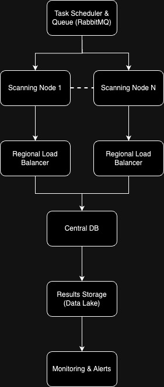

# Port Scanning Platform for Multi-Tenant IP Address Management

This repository provides a solution to perform scalable port scanning on IP addresses across multiple tenants. The solution includes:
1. **A basic script** to iterate through IP addresses and run a mock port scan (Part A).
2. **An architectural overview** for a scalable solution to manage weekly port scans on a large number of IP addresses across global tenants (Part B).
3. **An extended script** to simulate a distributed system that handles the large-scale, multi-node scanning requirements from Part B (Part C).

## Table of Contents
- [Overview](#overview)
- [Part A: Basic Port Scanning Script](#part-a-basic-port-scanning-script)
- [Part B: Scalable Architecture Design](#part-b-scalable-architecture-design)
- [Part C: Distributed Scanning Script](#part-c-distributed-scanning-script)
- [Usage](#usage)
- [Dependencies](#dependencies)

---

## Overview

The goal of this solution is to create a robust, distributed system capable of scanning 50,000 IP addresses per tenant, across 1,000 tenants, every week. This requires handling approximately 50 million IPs and generating results reliably and efficiently.

---

## Part A: Basic Port Scanning Script

The basic script iterates through a list of IP addresses and performs a mock port scan on each, using the provided `scan.py` script. This script serves as a starting point for port scanning without any distributed architecture.

### `question_a.py`

### How it Works
1. Reads a list of IP addresses.
2. For each IP address, calls the `scan.py` script to perform a mock scan.
3. Outputs the scan result.

---

## Part B: Scalable Architecture Design

For large-scale scanning across tenants, I designed a scalable system that includes:
- **Distributed Scanning Nodes**: Multiple scanning nodes in various regions to handle large volumes of scans in parallel.
- **Load Balancer**: Routes scanning requests to appropriate nodes based on region and load.
- **Task Scheduler & Queue**: Distributes tasks efficiently to each scanning node.
- **Central Database**: Manages tenant data, IPs, and scan schedules.
- **Results Storage and Monitoring**: Stores scan results and monitors system health.

### Architecture Diagram



### Design Benefits
- **Scalability**: Distributed nodes allow for parallel scanning, reducing the time needed to complete scans.
- **Resilience**: Load balancers and multiple nodes prevent single points of failure.
- **Efficiency**: Regional nodes reduce latency and improve performance.

---

## Part C: Distributed Scanning Script

This script simulates a distributed scanning system where each node fetches its scanning tasks from a central scheduler. It is designed to handle large-scale, distributed scanning efficiently.

### `question_c.py`

### How it Works
1. The scanning node continuously fetches a list of IP addresses assigned to it by the scheduler.
2. Each IP address is scanned using `scan.py`.
3. The node waits before fetching more tasks to manage load effectively.

---

## Usage

1. **Part A**: Run the `question_a.py` script to perform a basic port scan on a list of IPs.
   ```bash
   python question_a.py
   ```

2. **Part C**: Run `question_c.py` on each scanning node with a unique `node_id`.
   ```bash
   python question_b.py
   ```

   This assumes that each node has access to the `scan.py` script and can reach the task scheduler API.

---

## Dependencies

Ensure you have the following installed:
- **Python 3.11+**
- **Requests** library for API requests (for Part C)
  ```bash
  pipenv install --ignore-pipfile
  ```

---


# Follow-up Solutions for Scalable Port Scanning

This section addresses follow-up questions for managing challenges in scalable port scanning across multi-tenant environments, including handling timeouts, IP-level rate limiting, infrastructure upgrades, and resource fairness in multi-tenancy.

---

## 1. Intermittent Timeouts: How to Handle Timeouts During the Scan?
Timeouts can occur during port scans due to various reasons, such as network latency, firewalls, or the remote host being temporarily unreachable. Here’s how they could be handled:

- **Retry Logic**: Implement a retry mechanism to automatically retry the scan for IPs that time out. Limit retries to a certain number (e.g., 3 retries) with exponential backoff to avoid aggressive scanning and reduce the risk of getting blocked.
  
- **Timeout Handling**: Use specific timeout settings for the port scan command. For example, allow a maximum wait time for responses from each port. Adjust these settings based on network conditions and expected response times.

- **Logging and Alerting**: Log timeouts and send alerts for manual review if certain IPs consistently time out. This can help identify problematic hosts that may need a different approach.

- **Failover Strategy**: If scanning from a particular node results in timeouts, redirect the scan to another node closer to the IP or with a more reliable network connection.

---

## 2. IP-Level Rate Limiting: How to Implement Rate Limiting During the Scan?
Rate limiting ensures that scans do not overwhelm the target IP or violate service-level agreements. Here’s how to implement IP-level rate limiting:

- **Rate Limit Per IP**: Modify the scanning script to accept a rate limit parameter for each IP. This can be set based on historical data, client requirements, or detected network conditions. For example, set a rate limit of 500 packets per second for IPs with low tolerance and a higher limit for more resilient IPs.

- **Dynamic Rate Adjustment**: Implement logic that dynamically adjusts the rate limit based on feedback from the scan. For example, if the script detects packet loss or responses slowing down, it can reduce the rate limit.

- **Centralized Rate Limit Management**: Store rate limits for each IP in a database and have the scanning script fetch the limit for each scan. This allows rate limits to be managed centrally and adjusted without modifying the script directly.

- **Token Bucket Algorithm**: Implement a token bucket rate-limiting algorithm that allows a certain number of packets to be sent per second, refilling at a set rate. This can help control the number of scan packets sent to each IP per second effectively.

---

## 3. Infrastructure Management: How Can We Handle Infrastructure Upgrades During the Scan?
Handling infrastructure upgrades during active scans requires careful planning to avoid disruptions:

- **Rolling Updates**: Use rolling updates for infrastructure changes, updating a few nodes at a time while others continue scanning. This ensures that the scanning process is not completely paused during upgrades.

- **Canary Deployments**: Deploy new infrastructure or updates to a small subset of nodes first, monitoring their performance before rolling out the changes to the entire system.

- **Pause and Resume Capability**: Implement a mechanism to pause ongoing scans and resume them from where they left off once the upgrades are complete. This can be achieved using stateful job tracking and a robust task scheduler.

- **Scheduled Maintenance Windows**: Schedule infrastructure upgrades during off-peak hours or at times when scans are less critical, minimizing the impact on scanning operations.

- **Fallback Mechanism**: Have a backup infrastructure or alternative nodes ready to take over scanning in case the primary infrastructure undergoes a major upgrade that requires downtime.

---

## 4. Client Hogging in Multi-Tenancy: How Do We Ensure a Large Client Does Not Hog Resources for a Smaller Client During the Scan?
To ensure fair resource allocation among tenants, particularly when dealing with clients of different sizes, consider these approaches:

- **Resource Quotas**: Assign quotas to each client based on their size or priority. For instance, limit the maximum number of concurrent scans or allocate specific CPU and memory resources per tenant. This ensures that larger clients do not consume all available resources.

- **Weighted Scheduling**: Use a weighted round-robin or fair scheduling algorithm in the task scheduler, which allocates resources proportionally based on tenant size. Smaller clients receive adequate resources even when larger clients are active.

- **Rate Limits Per Tenant**: Implement rate limits per tenant to prevent a single client from consuming too much network bandwidth or compute capacity. These limits can be adjusted based on the tenant's contract or historical usage patterns.

- **Priority Queuing**: Use priority queues to prioritize tasks for smaller clients or those with more urgent needs. For example, give smaller clients higher priority during busy periods to ensure they receive timely scans.

- **Monitoring and Alerts**: Continuously monitor resource usage per client and set up alerts if a tenant's usage exceeds predefined thresholds. This allows for real-time adjustments to resource allocation policies.

---

## Conclusion
To summarize:
- **Timeouts** are managed through retry logic, timeout settings, logging, and failover strategies.
- **Rate limiting** is controlled per IP using dynamic adjustments, centralized settings, and token bucket algorithms.
- **Infrastructure management** uses rolling updates, canary deployments, and pause/resume capabilities to handle upgrades smoothly.
- **Multi-tenancy issues** are addressed with quotas, weighted scheduling, rate limits, priority queuing, and monitoring.

Each solution involves a combination of proactive design, robust error handling, and dynamic adjustments to ensure a reliable, scalable port scanning system that can accommodate diverse client needs effectively.

---

## License

This project is open source and available under the MIT License.

